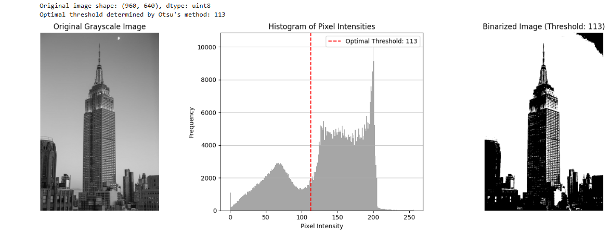
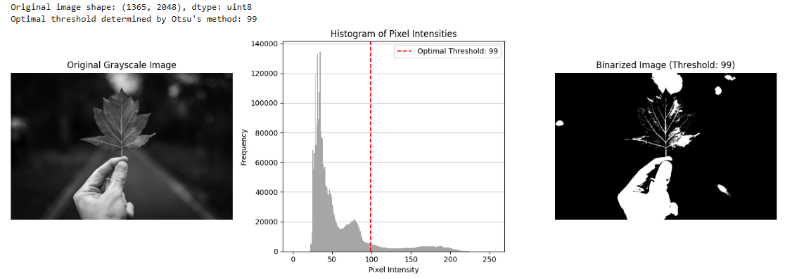
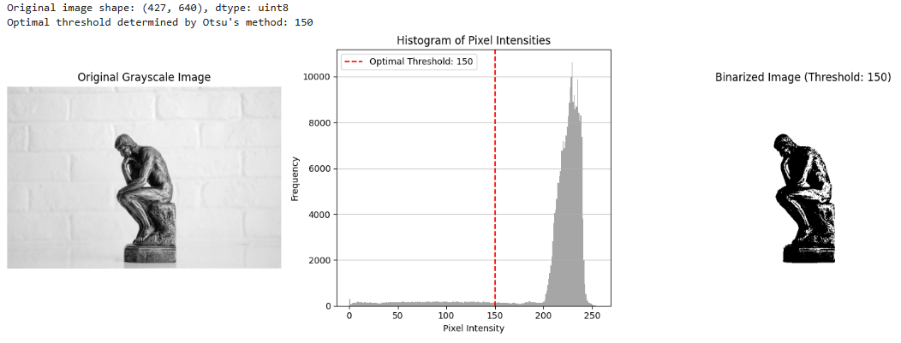

# Otsu's Thresholding Implementation

Automated image thresholding using Otsu's method for optimal grayscale separation.





## Project Objective
Implementation of Otsu's algorithm to:
- Automatically determine optimal threshold
- Separate foreground/background in grayscale images
- Compare with manual thresholding results

## Technologies Used
- Python 3.8+
- OpenCV (`cv2`)
- NumPy
- Matplotlib (for visualization)

## How to Run
```bash
# Install dependencies
pip install -r requirements.txt

# Run the implementation
python src/otsu.py -i images/input/sample.jpg
